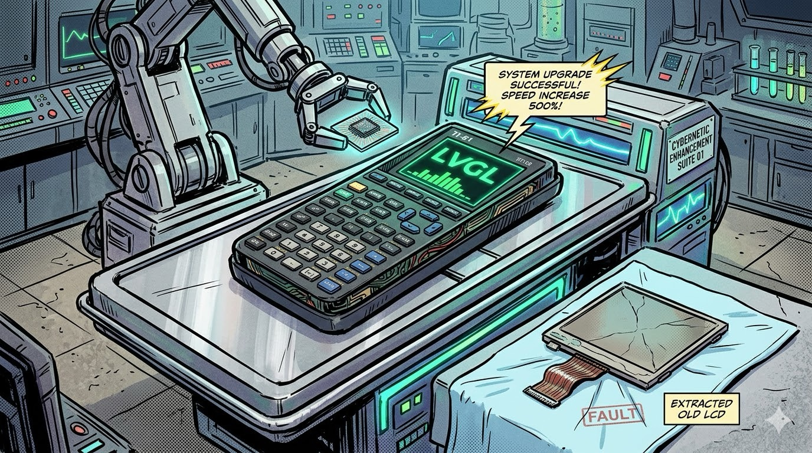

# Neo-81: bringing new life to the classic.

[](https://github.com/mndxc/STM32F429-TI81-Calculator/actions)
[](LICENSE)
[](CONTRIBUTING.md)




## Why

The TI-81 was the first graphing calculator that was genuinely accessible for learning — affordable, approachable, and in the hands of a generation of students. It also has a look that hasn't aged: boxy, purposeful, built to last.

The problem is that the originals are now 30+ years old and the displays are failing. Rather than let them become landfill, this project replaces the internals while keeping everything that made the hardware iconic. A fresh screen, a modern MCU, and the same keypad you already know.

The end goal is a calculator you can actually use — not a shelf piece. That means completing the feature set, finishing the custom PCB, and ending up with something better than the original: same form factor, same feel, working display, and no artificial limits on what it can do.

---

## Hardware

STM32F429I-DISC1 (Cortex-M4, 180 MHz, 2.4" ILI9341 display, 8 MB SDRAM) with a salvaged TI-81 key matrix wired to the GPIO header.

**Software:** LVGL v9 · FreeRTOS · GCC ARM · CMake

---

## Status

**PRGM is feature-complete and host-tested (hardware validation pending):** The text interpreter implements the TI-81 PRGM spec — `If` (single-line), `Goto/Lbl`, `IS>(`, `DS<(`, `Pause`, `Stop`, subroutine calls (depth 4), `Disp`, `Input`, `ClrHome`, `DispHome`, `DispGraph`, assignment, and expression lines. Execution model: entering `prgmNAME` runs the program and displays `Done`. Programs persist in FLASH. A 77-test host suite (`test_prgm_exec`) validates all active command handlers and control-flow paths. Hardware validation (P10) is the only remaining gate.

MATRIX is ~95% complete: variable dimensions (1–6×6), full arithmetic (+, −, ×, scalar×matrix), det, transpose, all row operations, scrolling cell editor with dim-mode resizing, FLASH persistence, and column-aligned history display with horizontal scroll.

STAT is not yet implemented.

---

## No hardware? No problem.

You can build and run the full test suite on any machine — no STM32 board required.

```bash
git clone https://github.com/mndxc/STM32F429-TI81-Calculator.git
cd STM32F429-TI81-Calculator
cmake -S App/Tests -B build/tests && cmake --build build/tests
./build/tests/test_calc_engine && ./build/tests/test_expr_util && \
./build/tests/test_persist_roundtrip && ./build/tests/test_prgm_exec
```

All 378 tests pass on plain x86/ARM Linux and macOS with any standard C compiler. No toolchain, no board, no USB cable needed.

---

## Documentation

| I want to… | Go here |
|---|---|
| Build and flash the firmware | [docs/GETTING_STARTED.md](docs/GETTING_STARTED.md) |
| Understand the architecture | [docs/ARCHITECTURE.md](docs/ARCHITECTURE.md) |
| Read the full technical reference | [docs/TECHNICAL.md](docs/TECHNICAL.md) |
| Run the host tests | [docs/TESTING.md](docs/TESTING.md) |
| Troubleshoot common issues | [docs/TROUBLESHOOTING.md](docs/TROUBLESHOOTING.md) |
| See open quality & readiness issues | [docs/QUALITY_TRACKER.md](docs/QUALITY_TRACKER.md) |
| Understand display stability and power-off behaviour | [docs/DISPLAY_STABILITY.md](docs/DISPLAY_STABILITY.md) |
| Understand power management and Stop mode | [docs/POWER_MANAGEMENT.md](docs/POWER_MANAGEMENT.md) |
| Contribute | [CONTRIBUTING.md](CONTRIBUTING.md) |

### Datasheets

| File | Component |
|---|---|
| [TI81Guidebook.pdf](docs/Datasheets/TI81Guidebook.pdf) | TI-81 user manual — calculator behaviour, key layout, PRGM syntax (pages 133–150) |
| [RT9471Charger.pdf](docs/Datasheets/RT9471Charger.pdf) | Richtek RT9471 — LiPo charger with power-path management |
| [W25Q128JVSIQFlashMem.pdf](docs/Datasheets/W25Q128JVSIQFlashMem.pdf) | Winbond W25Q128JV — 16MB SPI NOR flash for firmware XIP + user data |
| [RT4812Boost.pdf](docs/Datasheets/RT4812Boost.pdf) | Richtek RT4812 — 5V boost (DNF Rev1; reserved for Rev2 with RPi Zero 2 W) |
| [RT8059Buck.pdf](docs/Datasheets/RT8059Buck.pdf) | Richtek RT8059 — 3.3V main buck |
| [TPD4E05U06DQARDiode.pdf](docs/Datasheets/TPD4E05U06DQARDiode.pdf) | TI TPD4E05U06DQAR — USB ESD protection |

---

## Contributing

Contributions are welcome — bug fixes, feature work, or documentation improvements. See [CONTRIBUTING.md](CONTRIBUTING.md) for guidelines. All contributors are expected to follow the [Code of Conduct](CODE_OF_CONDUCT.md).
