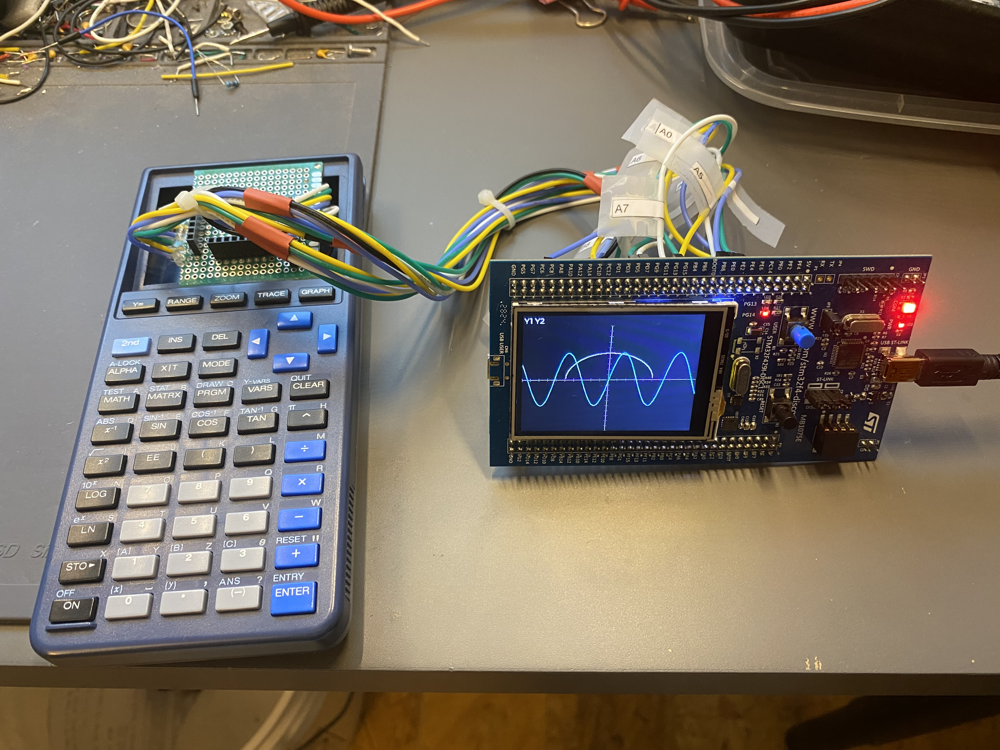

# STM32F429 TI-81 Calculator



A TI-81 inspired calculator running on the STM32F429I-DISC1 discovery board.
Built as a learning exercise and prototype for a future custom PCB build.

---

## Hardware

| | |
|---|---|
| MCU | STM32F429ZIT6 — Cortex-M4, 180 MHz |
| Board | STM32F429I-DISC1 |
| Display | 2.4" ILI9341 TFT, 240×320, landscape via LTDC |
| Keypad | TI-81 key matrix, 7 columns × 8 rows |
| SDRAM | IS42S16400J, 8 MB @ 0xD0000000 |

**Software stack:** LVGL v9 · FreeRTOS · GCC ARM · CMake

---

## What works

| Area | Status |
|---|---|
| Arithmetic `+ - × ÷ ^ x² x⁻¹` | ✅ |
| Trig, hyperbolic, log, `√` | ✅ |
| Variables A–Z, ANS, auto-ANS | ✅ |
| TEST operators `= ≠ > ≥ < ≤` | ✅ |
| NUM functions `round iPart fPart int` | ✅ |
| Expression wrap, scrolling history, history recall | ✅ |
| Insert / overwrite mode, UTF-8 cursor | ✅ |
| MODE screen (angle, decimal places, grid) | ✅ |
| MATH menu (MATH / NUM / HYP / PRB tabs) | ✅ |
| Y= editor — up to 4 equations | ✅ |
| Function graphing with axes, grid, tick marks | ✅ |
| RANGE editor (Xmin/Xmax/Yscl/Xres…) | ✅ |
| ZOOM menu — 8 presets, ZBox, Set Factors | ✅ |
| TRACE with X= / Y= readout | ✅ |
| STAT, PRGM, MATRIX | 🚧 Planned |

---

## Build

> Full build instructions, configuration gotchas, and architecture details are in [docs/TECHNICAL.md](docs/TECHNICAL.md).

**Requirements:** STM32CubeMX · arm-none-eabi-gcc · CMake 3.22+ · ST-LINK

```bash
# 1. Open STM32F429-TI81-Calculator.ioc in CubeMX and generate code once
# 2. Build
cmake -B build -DCMAKE_BUILD_TYPE=Debug
cmake --build build
# 3. Flash
st-flash write build/STM32F429-TI81-Calculator.bin 0x08000000
```

---

## Planned hardware

The final target is a custom PCB — STM32H7B0VBT6, 16-bit 8080 parallel display
(eliminates the LTDC pixel-clock artifact), LiPo charging, 3.3V buck. The
software — LVGL, FreeRTOS tasks, math engine, keypad driver — transfers
unchanged. Only the display port layer needs rewriting.
