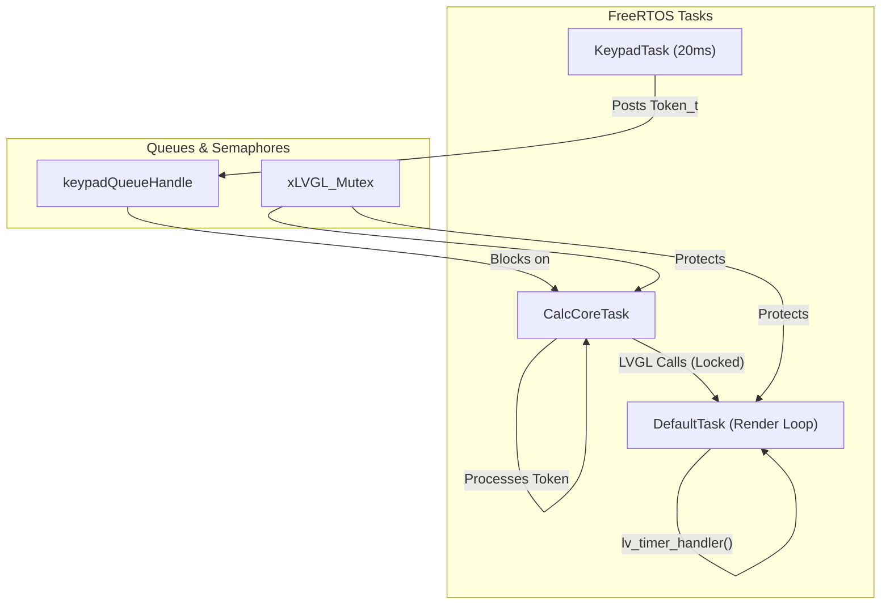
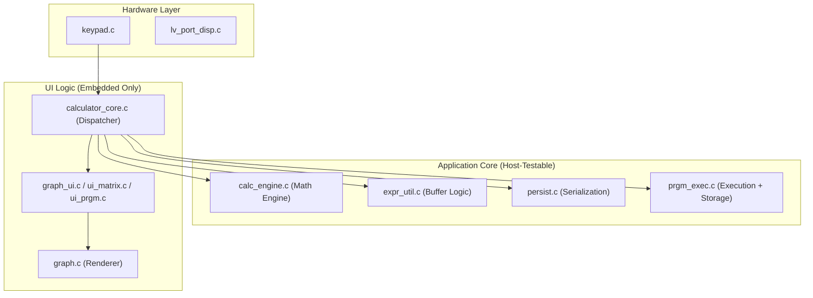

# Architecture Overview — STM32F429 TI-81 Calculator

A 5-minute orientation for new contributors. For the full technical reference see [TECHNICAL.md](TECHNICAL.md).

---

## Task Architecture

The system is split into three main FreeRTOS tasks to ensure responsive UI and accurate keypad scanning.



- **KeypadTask**: Scans the 7×8 matrix every 20ms and generates tokens.
- **CalcCoreTask**: The main logic processor. It waits for tokens from the queue and updates the calculator state and UI.
- **DefaultTask**: Handles LVGL initialisation (SDRAM, LTDC) and the display refresh loop.

**LVGL mutex rule:** all `lv_*` API calls must be wrapped with `lvgl_lock()` / `lvgl_unlock()`. Never call `lvgl_lock()` inside `cursor_timer_cb()` — it runs inside `lv_task_handler()` which DefaultTask already holds the lock for.

---

## Module Hierarchy

The project follows a layered architecture to maximize host-testability.



`Core/` (CubeMX-generated) is a dependency of everything but is never modified by hand.

---

## Directory Map

```
App/
  Src/            Custom application sources — all calculator logic lives here
    prgm_exec.c   Program execution interpreter (prgm_run_start/loop/execute_line) + FLASH sector 11 storage; analogous to persist.c for sector 10
  Inc/            Custom headers — public API for each App/Src module
  HW/             Hardware drivers — the only files that touch GPIO directly
    Keypad/         keypad.c: key matrix scanner; keypad_map.c: token-to-key lookup table
  Display/        LVGL port layer: display flush + input device
  Fonts/          JetBrains Mono LVGL bitmap fonts (24px, 20px)
  Tests/          Host-compiled test suites (301 tests, no HAL/RTOS needed)

Core/             CubeMX-generated: HAL init, FreeRTOS stubs, interrupt handlers
Drivers/          ST BSP + HAL + CMSIS (gitignored — regenerate via CubeMX)
Middlewares/      FreeRTOS + LVGL v9.x (gitignored)
cmake/            CMake toolchain files; cmake/stm32cubemx/ is CubeMX-generated
docs/             Architecture, technical reference, datasheets
```

The key distinction: **`App/` is yours, `Core/` is CubeMX's.** Never place custom code in `Core/` — it will be overwritten on the next CubeMX regeneration.

---

## Memory Layout

```
Internal RAM   192 KB  @ 0x20000000   ~49% used (FreeRTOS heap, stacks, app state — LVGL heap in SDRAM)
CCMRAM          64 KB  @ 0x10000000   ~59% used (prgm_store, prgm_flash_buf, RamFunc code)
FLASH            2 MB  @ 0x08000000   ~36% used (firmware image)
SDRAM           64 MB  @ 0xD0000000   external IS42S16400J; linker region from 0xD0070800

SDRAM layout:
  0xD0000000   LCD framebuffer     320×240×2 = 153,600 B  (fixed pointer)
  0xD0025800   graph_buf           320×240×2 = 153,600 B  (fixed pointer)
  0xD004B000   graph_buf_clean     320×240×2 = 153,600 B  (fixed pointer — trace cache)
  0xD0070800   .sdram section      64 KB — LVGL heap pool (NOLOAD, linker-placed)
  0xD0080800   free SDRAM          ~63.5 MB remaining

FLASH sector map (relevant sectors):
  Sector 10  0x080C0000  128 KB  — calculator variables, graph state, matrices
  Sector 11  0x080E0000  128 KB  — program storage (prgm_exec.c)
```

---

## Expression Evaluation Pipeline

```
User keypress
    │
    ▼
Token_t posted to keypadQueueHandle
    │
    ▼
Execute_Token()  [calculator_core.c]
    │  builds expression[] string character by character
    │
    ▼  (on ENTER)
Calc_Evaluate()  [calc_engine.c]
    │
    ├─ Tokenize()       infix string → TokenList_t
    ├─ ShuntingYard()   infix tokens → postfix (RPN) tokens
    └─ EvaluateRPN()    postfix tokens → CalcResult_t (float or matrix)
```

---

## UI Extension Pattern

Complex sub-menus live in their own `ui_<feature>.c` + `ui_<feature>.h` modules:

| Module | What it owns |
|---|---|
| `graph_ui.c` | Graph editor screens (MODE_GRAPH_YEQ, RANGE, ZOOM, TRACE, ZBox) |
| `ui_matrix.c` | Matrix cell editor UI (MODE_MATRIX_EDIT, MODE_MATRIX_MENU) |
| `ui_prgm.c` | Program menu and line editor UI (MODE_PRGM_*) |

Each module `#include "calc_internal.h"` to access shared calculator state (`current_mode`, `ans`, `insert_mode`, `cursor_visible`) and cross-module UI helpers (`lvgl_lock`, `screen_create`, `tab_move`, `menu_insert_text`).

To add a new feature screen: create `App/Src/ui_<feature>.c` + `App/Inc/ui_<feature>.h`, initialise the screen from `StartCalcCoreTask` in `calculator_core.c`, and add a handler delegation call in `Execute_Token()`.

---

## Adding a New Math Function

Four small additions are needed:

1. `App/HW/Keypad/keypad_map.h` — add `TOKEN_XXX` to the `Token_t` enum
2. `App/HW/Keypad/keypad_map.c` — map the token to a physical key in `TI81_LookupTable`
3. `App/Src/calculator_core.c` — append the function string to `expression[]` in `Execute_Token()`
4. `App/Src/calc_engine.c` — add the function name to `Tokenize()` and its evaluation to `EvaluateRPN()`

The shunting-yard algorithm (`ShuntingYard()`) does not need to change for standard unary/binary functions.
