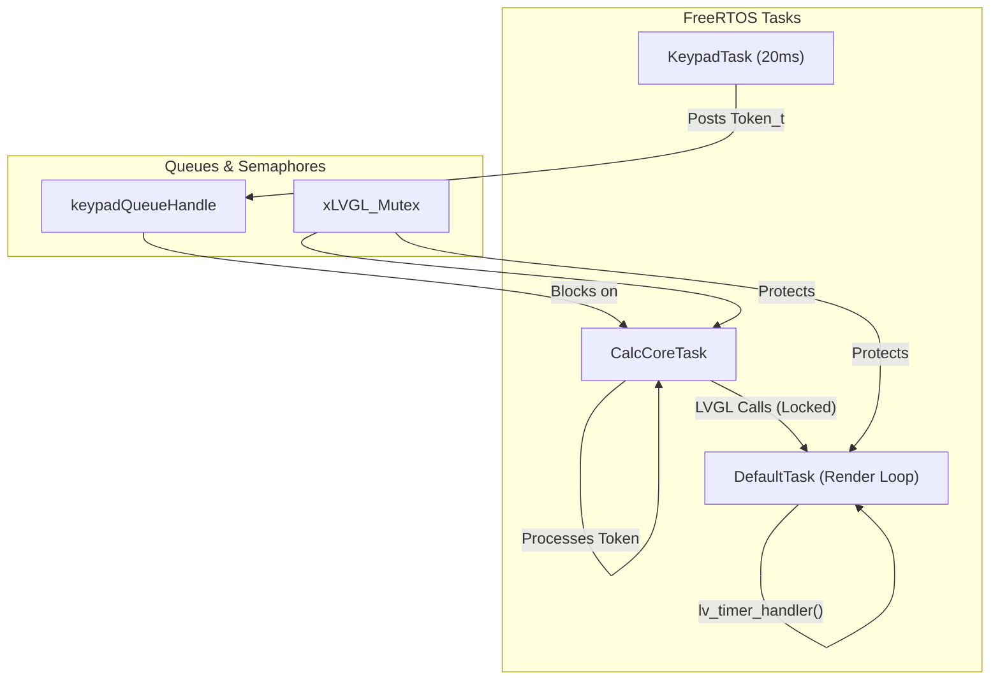
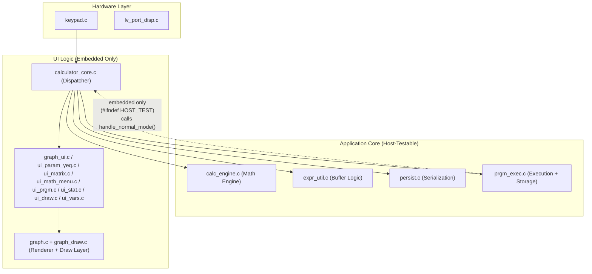

# Architecture Overview — STM32F429 TI-81 Calculator

A 5-minute orientation for new contributors. For the full technical reference see [TECHNICAL.md](TECHNICAL.md).

---

## Task Architecture

The system is split into three main FreeRTOS tasks to ensure responsive UI and accurate keypad scanning.



- **KeypadTask**: Scans the 7×8 matrix every 20ms and generates tokens.
- **CalcCoreTask**: The main logic processor. It waits for tokens from the queue and updates the calculator state and UI.
- **DefaultTask**: Handles LVGL initialisation (SDRAM, LTDC) and the display refresh loop.

**LVGL mutex rule:** all `lv_*` API calls must be wrapped with `lvgl_lock()` / `lvgl_unlock()`. Never call `lvgl_lock()` inside `cursor_timer_cb()` — it runs inside `lv_task_handler()` which DefaultTask already holds the lock for.

---

## Module Hierarchy

The project follows a layered architecture to maximize host-testability.



`Core/` (CubeMX-generated) is a dependency of everything but is never modified by hand.

**Note on `prgm_exec.c` layer membership:** In host builds `prgm_exec.c` is pure Application Core — it has no UI dependencies and is fully testable without hardware. In embedded builds it gains a conditional dependency on `calc_internal.h` (part of the UI super-module) so it can call `handle_normal_mode()` after evaluating a program expression line. The `#ifndef HOST_TEST` guard at the include site is what preserves host-testability. `calculator_core.c` is also host-testable via `calculator_core_test_stubs.h` (see `App/Tests/test_normal_mode.c`).

---

## Directory Map

Full annotated directory tree: [TECHNICAL.md — Project Structure](TECHNICAL.md#project-structure).

The key distinction: **`App/` is yours, `Core/` is CubeMX's.** Never place custom code in `Core/` — it will be overwritten on the next CubeMX regeneration.

---

## Memory Layout

RAM/CCMRAM/FLASH usage, SDRAM layout, and full FLASH sector map: [TECHNICAL.md — Memory Layout](TECHNICAL.md#memory-layout).

---

## Expression Evaluation Pipeline

```
User keypress
    │
    ▼
Token_t posted to keypadQueueHandle
    │
    ▼
Execute_Token()  [calculator_core.c]
    │  builds expression[] string character by character
    │
    ▼  (on ENTER)
Calc_Evaluate()  [calc_engine.c]
    │
    ├─ Tokenize()       infix string → TokenList_t
    ├─ ShuntingYard()   infix tokens → postfix (RPN) tokens
    └─ EvaluateRPN()    postfix tokens → CalcResult_t (float or matrix)
```

---

## UI Extension Pattern

How to add a new feature screen and which modules own which modes: [TECHNICAL.md — UI Extensibility Pattern](TECHNICAL.md#ui-extensibility-pattern).

---

## Adding a New Math Function

Four-step procedure (keypad_map.h → keypad_map.c → calculator_core.c → calc_engine.c): [TECHNICAL.md — Adding New Functions](TECHNICAL.md#adding-new-functions).
